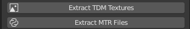
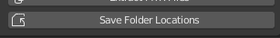
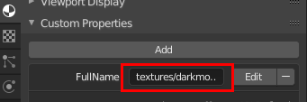
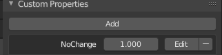

# Blender TDM Material Manager
## Version 2.2.2

## Introduction
When using Blender to work on objects for TDM (using the .lwo import/export features), the Blender material names must match the TDM material names. If you are making a lot of changes this can become quite tedious and error prone. This addon makes it easier to manage the situation.

This addon does two things:
* Sets the correct TDM-compatible material names according to the assigned texture;
  * Main use: for new objects which will be exported to TDM.
* Applies the correct texture depedning on the material name.
  * Main use: For objects that have been imported, which have the correct material names but no textures.

It has a few extra features to make it easier to use:
* Materials and textures need to be extracted, but this addon can do that for you;
* It allows materials and textures to be read from two folders each, which allows the addon to access standard TDM files <em>and</em> custom files from your FM;
* Material names can be 'locked' to prevent them being modified (useful when one texture is used by multiple materials);
* All folder locations can be saved in a config file so you don't have to set them for each new file, nor find the config file itself.
  * Note: Blender must be restarted for changed locations to automatically apply to <em>new</em> files.

## Installation
Blender addons can be installed by going to File > User Preferences > Addons tab > Install from File. You can select a .py file or the zip file that contains it, and Blender will put the addon in the correct folder. Once it has been installed you need to enable it, and then click on Save User Settings. <em>If you installed the previous version, you should find that by searching for TDM, and then click the Remove button before installing this version.</em>

The addon requires two things:
* The .mtr files from TDM's .pk4 files extracted to some folder.
* The TDM .dds textures extracted to some other folder.

### Configuring the Addon

* In Blender, the addon's controls are in the toolshelf (T to toggle by default), via the <strong>TDM</strong> tab;
* You need to tell the addon where The Dark Mod is installed;
* The addon requires TDM's material files and textures to be extracted somwhere (see next section). For this step, set the paths to those folders;
* If you use the <strong>Custom</strong> fields, the paths should be something like these:
  * <strong>[TDM folder path]\fms\fm-name\materials</strong>
  * <strong>[TDM folder path]\fms\fm-name\dds\textures\darkmod</strong>
* <em>The addon will look in the FM folders first, so if your FM overrides a TDM texture/material, the addon will use the one from the FM.</em>

### Extracting the Material Files and Textures
Below the folder fields are two extract buttons:  

* These extract the relevant files from TDM's pk4 files into the folders highlighted in the screenshot above.
  * If either of the latter two folders don't exist, they will be created during the extration.

### Save Folder Locations

* You can click on this button to save the mtr/texture locations to a config file, which Blender will read each time a file is opened or created;
* Those values are only defaults for new files. You can type new locations (without using the button), and they will be associated with the .blend file (standard Blender behaviour);
  * Note: Blender must be restarted for changed locations to automatically apply to <em>new</em> files.

## Usage
### Setting Material Names
* If you've made a new object, for each texture you must first create a material (the name doesn't matter) and load the texture into the first texture slot;
  * Remember to choose the texture from the TDM or FM textures locations.
* At any point during edting you can click on <strong>Set Material Names</strong>, and the addon will take the texture's location and scan the .mtr files to work out the correct TDM material name;
  * Some textures are used by multiple materials (they may use different normal/specular maps or other effects. In all the materials will be listed as Custom Properties:  
  
  * This behaviour also applies to collision textures. There are 36 materials to choose from.
		
### Loading Textures
* If you've imported an object, or you've already set material names but not loaded the textures, you can click on <strong>Load Textures</strong> and the addon will use the material's name to scan the .mtl files and load the correct texture;
		* By default Blender only shows material textures if the viewport shading is <strong>Texture</strong> or above. To view them in <strong>Solid</strong> mode, enable the <strong>Material Utils</strong> addon, then press <em>Shift Q</em>, then go to <strong>Specials > Material to Texface</strong>;
	* If a texture is loaded but doesn't seem to be mapped, check to see if the model has multiple UV layers.
	
## Known Limitations
* Blender has a maximum length for material names:
  * Most TDM materials can be fully set, but there are a few that just don't fit. If the addon finds such a material, it sets a placeholder material name, and uses a custom property to tell you the name it tried to set:
		
    
    * The only way round this problem is to copy that material to a custom .mtr file and give it a shorter name.
* Some textures are used by more than one material:
		* There are several shadow materials that all share one texture. The addon assumes the material is textures/common/shadow.
	* There are several collision materials that also share one texture. There's no way to know which is the correct material, so a 'warning' mame is used.
	* In other cases, the addon will always choose the first material it finds that matches the texture;
	* You can manually set a material name, and to keep it you can use a custom property to prevent the name being changed again:
		
		
	

I wrote this addon to make it easier for me to make Blender objects for TDM. I hope it's useful for you too.

R Soul (Robin Collier)
